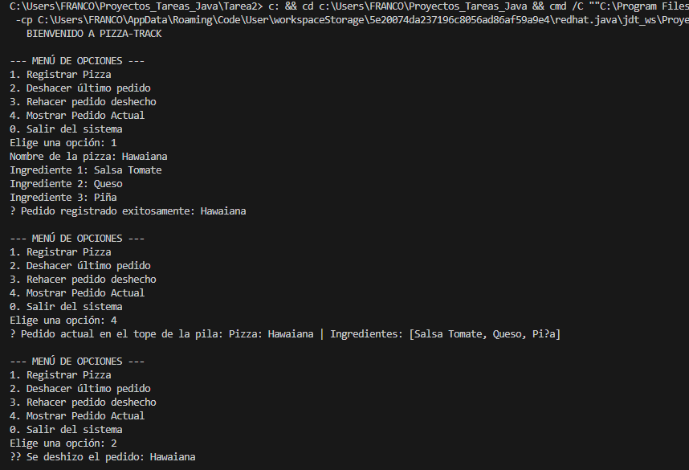
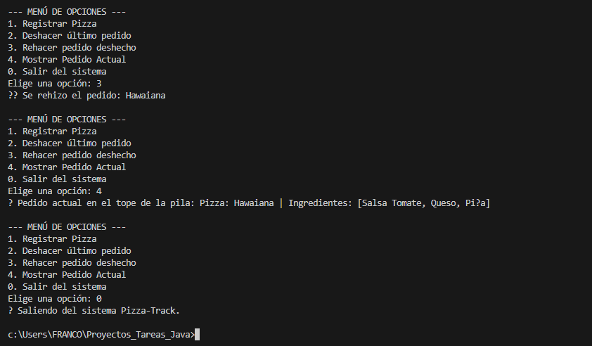

#  Pizza-Track: Simulador de Gestión de Pedidos

## Objetivo del Proyecto
El objetivo de este proyecto es implementar el concepto de estructura de datos tipo **Pila (LIFO)** utilizando Listas Ligadas en Java. A través de este simulador de una pizzería, se gestionan los pedidos aplicando funcionalidades de **Undo (Deshacer)** y **Redo (Rehacer)** mediante el manejo de dos pilas manuales.

##  Instrucciones de Ejecución
Para hacer funcionar este simulador en tu máquina local, sigue estos pasos:
1. Asegúrate de tener instalado el JDK de Java (recomendado Eclipse Temurin).
2. Clona o descarga este repositorio.
3. Abre la carpeta del proyecto en tu editor preferido (ej. VS Code).
4. Compila y ejecuta el archivo principal: `Main.java`.
5. Interactúa con el menú numérico directamente en la consola.

## Capturas de Pantalla de la Consola
Aquí se evidencia el funcionamiento del ciclo completo solicitado: **Registro -> Deshacer (Undo) -> Rehacer (Redo)**.

### Parte 1: Registro de Pizza Hawaiana y Deshacer pedido (Undo)
En esta captura se muestra el inicio del programa, el registro exitoso de la pizza, la verificación de que está en el tope de la pila (opción 4) y la ejecución del comando Deshacer (opción 2).

### Parte 2: Rehacer pedido (Redo) y Mostrar Tope de la Pila
A continuación, se observa la recuperación de la pizza deshecha usando Rehacer (opción 3), la confirmación de que volvió al tope de la pila (opción 4) y la salida limpia del sistema.

## Video de Sustentación Individual
En el siguiente enlace explico la lógica de los métodos `push()` y `pop()` implementados manualmente, además de la prueba de ejecución del programa:

**[Ver el video de sustentación aquí]([https://drive.google.com/file/d/1zdN3Zkt5_5V3LBdIdfDhoGBEEPZLnW-M/view?usp=sharing])**